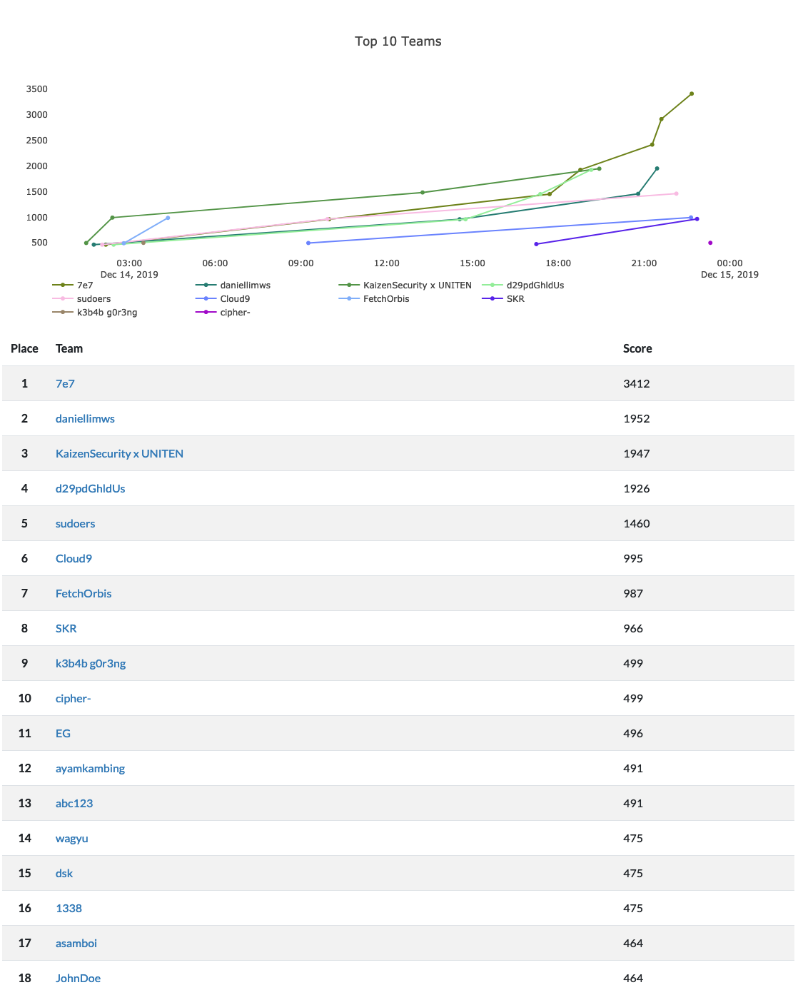

# Wargames.MY CTF
#### *Date*

```text
START: 00:01 14-12-2019 | END: 00:01 15-12-2019
```

#### *Rules*

```text
1. Maximum of three(3) people per team
2. No off-the-shelf automated scanning tools such as Nessus, OpenVAS, etc. It's useless and we'll kick you out for that lame ass shit
3. No cooperation between players with independent accounts. Sharing of flags or providing revealing hints to other players is cheating, don't do it
4. No attacking the competition infrastructure. If bugs or vulns are found, please alert the competition organizers immediately
5. Absolutely no sabotaging of other competing players, or in any way hindering their independent progress
6. No brute forcing of challenge flag or keys against the scoring server
7. No flooding or DoS attacks. Teams caught in the act will be penalized by a time penalty or a disqualification.
8. The rules and regulations will or might be updated without prior notice
9. At all times, the decision of the WGMY Crew is final on any matter in question
```

#### *ELIGIBILITY*

```text
- To be eligible for prizes, players must fit the following criteria:
    - Malaysian citizen
    - Submit write-up(s) within 48 hours after CTF ends
- Non-Malaysian are still welcomed to register and play; however, you won’t be eligible for the prizes
```

#### *Write-up*

* [Full Writeup](writeups/7e7Writeup.pdf) from 7e7
* [Full Writeup](https://daniellimws.github.io/wargamesmy-19/writeups) from daniellimws
* [Full Writeup](https://github.com/kaizensecurity/WGMY2019) from KaizenSecurity x UNITEN 
* [Full Writeup](writeups/woitheuKWriteup.pdf) from d29pdGhldUs
* [Full Writeup](https://github.com/Amjad50/WGMY-CTF-2019) from sudoers

|Challenge|Links|
|---------|-----|
| NothingToSeeHere | | 
| MyPWNSQL | | 
| PwnKotakItu | | 
| PHP Playground | * [Developer](writeups/WGMY%20December%202019%20Challenge%20-%20PHP-Perpustakaan%20PHAR%20Deserialization.pdf) | 
| babypwn | | 
| masakan | | 
| steal | | 
| malu apa bossku | | 
| interpreter_from_hell | * [Source](source/interpreter_from_hell/)| 
| robot-captcha | * [Source](source/ROBOT-CAPTCHA/)| 
| ayah-peng.pcapng | | 
| stream | | 
| easytalk.wav | | 


#### *Final Scoreboard*




#### *Sponsors*
<p align="center">
<a href="https://pentesterlab.com/">
    <image src="logo/pentesterlab.png" height="40">
</a>
<a href="https://www.facebook.com/askpentest/">
    <image src="logo/askpentest.png" height="60">
</a>
<a href="https://thebugbounty.com/">
    <image src="logo/tbb.png" height="40">
</a>
<a href="http://www.training.my/">
    <image src="logo/pentestmy.png" height="40">
</a>
<a href="https://www.securelytics.my/">
    <image src="logo/securelytics.png" height="30">
</a>
<a href="https://www.linkedin.com/company/syntx-my/about/">
    <image src="logo/syntx.png" height="60">
</a>
<a href="https://www.sysarmy.net/">
    <image src="logo/sysarmy.png" height="50">
</a>
<a href="https://exploitable.host/">
    <image src="logo/exploitablehost.png" height="60">
</a>
<a href="https://www.thecamparound.com/">
    <image src="logo/thecamparound.png" height="25">
</a>
<a href="https://nanosec.asia/">
    <image src="logo/nanosec.png" height="50">
</a>
</p>
